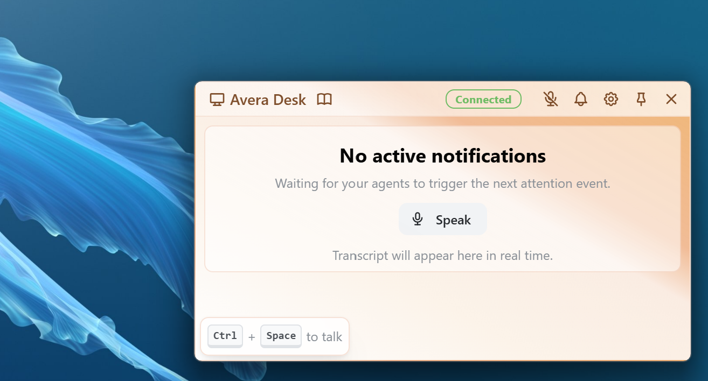
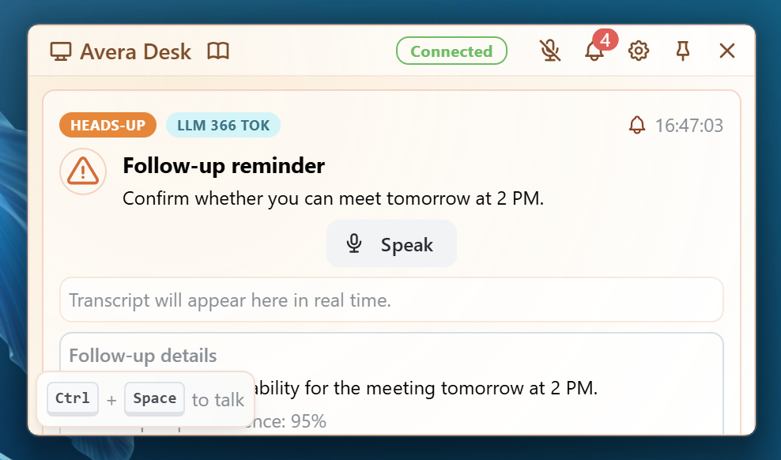
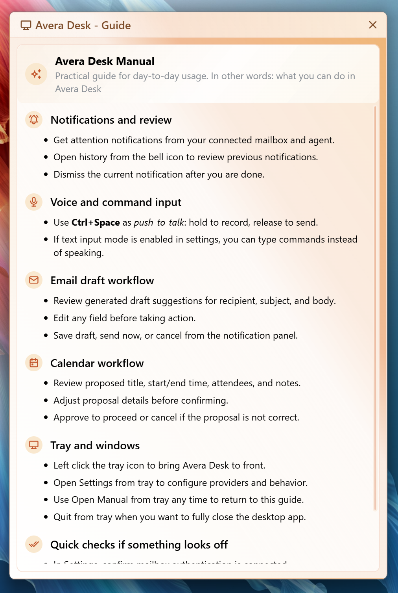
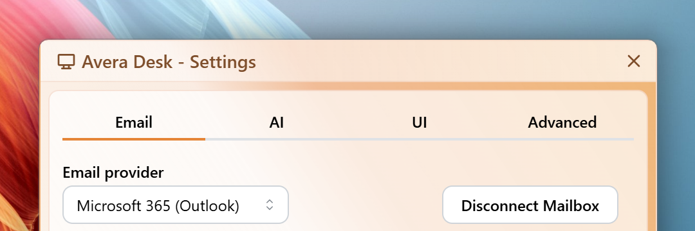

# Avera Desk Monorepo

Monorepo for Avera Desk desktop product:

- frontend: Tauri v2 + React desktop UI
- backend: FastAPI service (REST + WebSocket + background workers)
- docs: release and supporting notes

This file is the repo-level entrypoint. Use folder READMEs for implementation details:

- frontend/README.md for UI runtime, windows, tray behavior, and frontend API usage
- backend/README.md for backend routes, WebSocket contract, local security, and env toggles



## Quick Start (Desktop App)

Primary local workflow:

```powershell
cd frontend
npm install
npm run tauri dev
```



What this does today:

- starts Vite UI on port 1420
- starts backend via frontend/scripts/dev-api.mjs
- launches Tauri desktop shell

In this workflow, you usually do not run backend manually.

## Build A Desktop Binary

```powershell
cd frontend
npm run tauri build
```

Current build chain (from frontend/src-tauri/tauri.conf.json):

- beforeBuildCommand: npm run build:backend && npm run build
- frontend web output: frontend/dist
- bundled backend sidecar: frontend/src-tauri/resources/backend/avera-backend.bin

## Product Snapshot

- Multi-window desktop flow with labels: main, startup, settings, manual
- Tray menu for opening main/settings/manual and quitting the app
- Global push-to-talk shortcut: Ctrl+Space
- OAuth provider selection: Microsoft 365 or Gmail
- Backend local desktop security model:
	- HTTP token header for /api routes
	- short-lived single-use ws_ticket for /ws



## OAuth Summary

Provider is selected by email_provider setting (m365 or gmail), then login begins via:

- GET /api/oauth/login-url

Callback routes:

- Microsoft: /api/oauth/callback
- Gmail: /api/oauth/google/callback
- both support GET and POST callbacks

Current product limitation:

- calendar endpoints are only available when provider is m365



## Where To Go Next

- frontend/README.md: frontend scripts, renderer behavior, and contracts used by UI
- backend/README.md: route inventory, WebSocket messages, env flags, and security behavior

## License

MIT License
